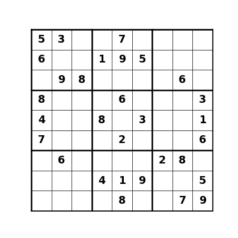
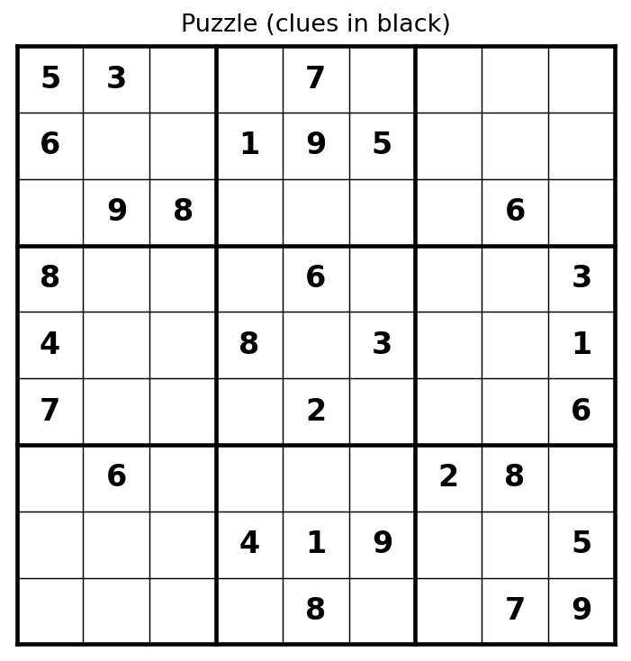
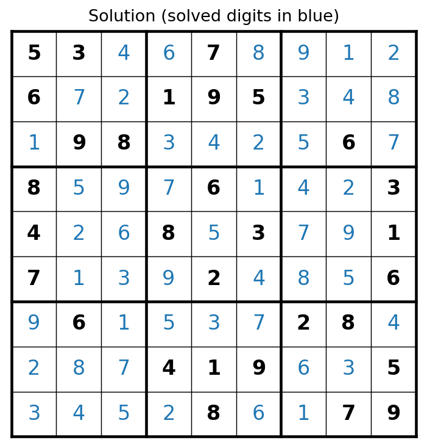

# Sudoku Solver

A Python Sudoku solver using **constraint propagation + backtracking**, with
both a command-line interface and a **graphical interface** where you can type
in a puzzle or load one from a file, and get the solution back as text and as
an image.

Originally written in Pascal in 2010 at Sharif University of Technology,
converted to Python in 2024.

<p align="center">

</p>

## Example

| Puzzle | Solution |
|---|---|
|  |  |

Clues are black; digits found by the solver are blue. Solving the classic
puzzle above takes 1,959 place/backtrack steps to settle the 51 empty cells —
the animation replays the 51 placements that survive.

## Two ways to use it

### 1. Graphical interface

```bash
python sudoku_gui.py
```

- **Type the clues** directly into the grid, leaving unknown cells empty, or
  click **Load puzzle…** to browse for a puzzle text file.
- Click **Solve**. The app automatically writes the puzzle to `puzzle.txt`,
  solves it, fills the grid (solved digits in blue), and saves the result as
  both `solution.txt` and `solution.png`.
- Invalid input is caught up front: non-digits are rejected as you type, and
  conflicting clues (e.g. two 5s in one row) produce a clear error message
  instead of a doomed solve.

The GUI uses tkinter, which ships with the standard Python installers on
macOS and Windows (on some Linux distributions: `sudo apt install python3-tk`).
The PNG output needs matplotlib; without it, the text outputs still work.

### 2. Command line

Create a text file containing the unsolved puzzle, one row per line, `0` for
empty cells:

```
5 3 0 0 7 0 0 0 0
6 0 0 1 9 5 0 0 0
0 9 8 0 0 0 0 6 0
8 0 0 0 6 0 0 0 3
4 0 0 8 0 3 0 0 1
7 0 0 0 2 0 0 0 6
0 6 0 0 0 0 2 8 0
0 0 0 4 1 9 0 0 5
0 0 0 0 8 0 0 7 9
```

(the compact `530070000` one-string-per-row format is also accepted), then:

```bash
python sudoku_solver.py sudoku.txt
```

which prints the solution and writes `solution.txt` and `solution.png`. If
the puzzle has no solution, it says so.

Or use the class directly:

```python
from sudoku_solver import SudokuSolver

solver = SudokuSolver()
solver.load_sudoku('sudoku.txt')      # or solver.load_from_array(grid)
if solver.solve():
    solver.print_sudoku()
    solver.save_sudoku('solution.txt')
    solver.render('solution.png')
else:
    print("No solution exists")
```

## How it works

**Constraint propagation.** Three arrays of sets track which digits are still
available in each row, column, and 3×3 block. A placement is legal exactly
when the digit is present in all three sets, so validity checks are O(1) set
membership instead of scanning the board.

- `rows[i]`, `cols[j]`, `blocks[b]` start as {1…9} and shrink as clues load.
- `get_block_index(row, col)` maps a cell to its 3×3 block: `(row // 3) * 3 + (col // 3)`.

**Backtracking.** `solve()` takes the next empty cell, tries each digit that
survives the set check, recurses, and undoes the placement if the branch dies:

- `place_number` / `remove_number` keep the three set families exactly in
  sync with the board, so the state after a backtrack is identical to the
  state before the attempt.
- When a cell has no legal digit, it is pushed back onto the empty list and
  the previous cell tries its next candidate.

The combination is what makes it fast: propagation prunes most candidates
before the recursion ever tries them, and backtracking guarantees
completeness — if a solution exists, it will be found.

## Files

```
sudoku_solver.py    solver class + command-line interface
sudoku_gui.py       tkinter GUI (grid entry, file browse, PNG/TXT output)
sudoku.txt          example puzzle
figures/            images used in this README
```

## License

MIT — see [LICENSE](LICENSE).
